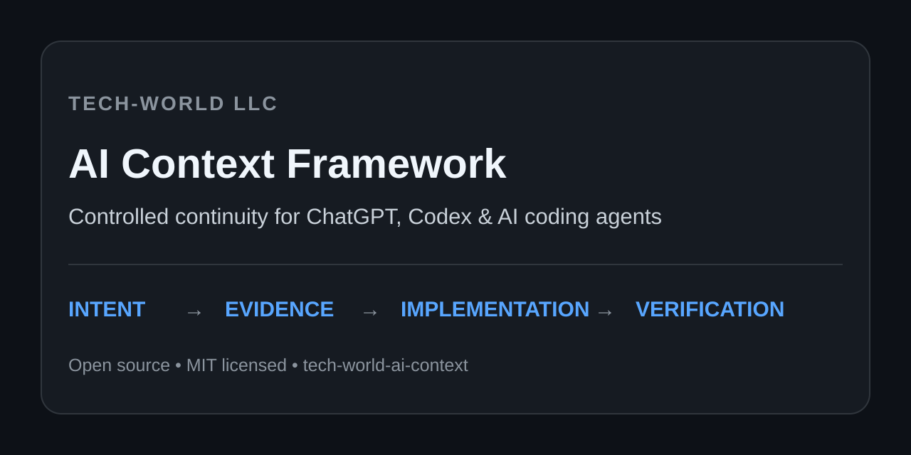

# Tech-World AI Context Framework

**Controlled continuity for ChatGPT, Codex, and AI coding agents.**

[](VERSION)
[](LICENSE)

<p align="center">
  
</p>

A layered, versioned framework for keeping long-running AI-assisted work grounded in **current project truth** without destroying **historical truth**.

> Conversation history preserves intent.  
> Current state records preserve what is believed true now.  
> Authoritative artifacts verify what is actually true.  
> Append-only history preserves what happened before.

**Current framework version: 2.2.1**

Created and maintained by **Tech-World LLC**.

## What changed in v2.2

The framework now defines a three-layer continuity architecture:

```text
Public operating guidance
        ↓
Private canonical live state
        ↓
Authoritative project artifacts / live systems

Append-only event history remains alongside current state rather than being rewritten.
```

For a continuing project, the preferred review sequence is:

1. Resolve one permanent `project_id` from an authorized private register.
2. Read current `STATE.json` and `HANDOFF.md`.
3. Apply confirmed `DECISIONS.md` and `CORRECTIONS.md`.
4. Verify material facts against the actual repository, system, contract, file, dashboard, or other authoritative source.
5. Keep `last_activity_at`, `last_changed_at`, and `last_verified_at` separate.
6. Update current state and append a historical event after a material confirmed change.

See [`docs/live-context-protocol.md`](docs/live-context-protocol.md).

## Precedence

When sources disagree, use this order within authorized project context:

1. Newest explicit user correction, approval, rejection, or decision.
2. Current authoritative artifact or directly observed live state.
3. Current private project/repository instructions and state records.
4. Current public operating guidance.
5. Earlier confirmed conversation context.
6. Estimates, assumptions, or external inferences.

Higher-priority platform, safety, legal, privacy, and access-control requirements still apply.

## Status is evidence, not optimism

For substantial software work:

```text
Requested → Implemented → Code-Verified → Runtime-Tested → Deployed → User-Accepted
```

A source edit is not a deployment. A deployment is not acceptance. Missing evidence stays missing.

## Public/private boundary

This repository is intentionally public and sanitized. It contains methods, templates, schemas, and reusable guidance—not populated private project records.

Never publish credentials, customer records, private schedules, contracts, financial-account data, confidential correspondence, health records, live lead data, production secrets, or populated private project state here.

A private implementation may maintain:

- `current-project-register.json`
- `projects/<project_id>/PROJECT.md`
- `projects/<project_id>/STATE.json`
- `projects/<project_id>/DECISIONS.md`
- `projects/<project_id>/CORRECTIONS.md`
- `projects/<project_id>/HANDOFF.md`
- `projects/<project_id>/SOURCES.md`
- `history/project-events.ndjson`

The public schemas are in [`schemas/`](schemas/).

## Core repository files

- [`bootstrap.md`](bootstrap.md) — stable public entry point.
- [`docs/live-context-protocol.md`](docs/live-context-protocol.md) — current-state + historical-continuity protocol.
- [`docs/continuity-model.md`](docs/continuity-model.md) — corrections, provenance, conflict handling, and status semantics.
- [`docs/public-private-boundary.md`](docs/public-private-boundary.md) — trust boundary for public vs private information.
- [`docs/project-standard.md`](docs/project-standard.md) — repository-level project controls.
- [`templates/project-register.template.md`](templates/project-register.template.md) — human-readable private project starter.
- [`schemas/project-register.schema.json`](schemas/project-register.schema.json) — canonical register schema.
- [`schemas/project-state.schema.json`](schemas/project-state.schema.json) — current-state schema.
- [`schemas/project-event.schema.json`](schemas/project-event.schema.json) — append-only event schema.
- [`AGENTS.md`](AGENTS.md) — repository instructions for contributors and coding agents.
- [`VERSION`](VERSION) and [`CHANGELOG.md`](CHANGELOG.md) — release identity and history.

## Quick start

### 1. Host a stable public bootstrap

Publish a small public entry point at a stable URL you control. Tech-World's reference implementation is:

**https://tech-worldllc.com/ai-context/bootstrap.md**

### 2. Point persistent AI instructions to it

Keep persistent instructions compact. Tell the assistant when to retrieve the bootstrap, how to reconcile it with current evidence, and what to do if it is unavailable.

See [`templates/custom-instructions.example.md`](templates/custom-instructions.example.md).

### 3. Put project-specific instructions next to the code

Use an `AGENTS.md` in each substantial repository for the actual stack, protected behavior, build/test commands, deployment boundary, risks, and verification requirements.

See [`templates/AGENTS.template.md`](templates/AGENTS.template.md).

### 4. Keep current state private and canonical

Use one permanent project ID per real continuing project. Renames become aliases; they do not create a second project. Mark stale or unverified facts explicitly instead of making them look current.

### 5. Verify against reality

The private state record is an index, not a substitute for the real artifact. Repositories, live systems, signed records, official documentation, and directly observed output remain authoritative when material.

## Validation

Run:

```bash
python scripts/validate_repo.py
```

GitHub Actions runs repository validation on pushes and pull requests. The release workflow validates again and publishes the `VERSION` as a GitHub release when that version does not already exist.

## Compatibility

The formal v1 compatibility requirements remain in [`docs/specification-v1.md`](docs/specification-v1.md). v2.2 extends the operating model with live canonical state and append-only history without changing the rule that actual artifacts and explicit corrections outrank stale conversational recollection.

## Security and governance

See [`SECURITY.md`](SECURITY.md), [`GOVERNANCE.md`](GOVERNANCE.md), [`CONTRIBUTING.md`](CONTRIBUTING.md), and [`TRADEMARKS.md`](TRADEMARKS.md).

The framework is licensed under the [`MIT License`](LICENSE). The license does not grant permission to imply Tech-World sponsorship, certification, or endorsement.
